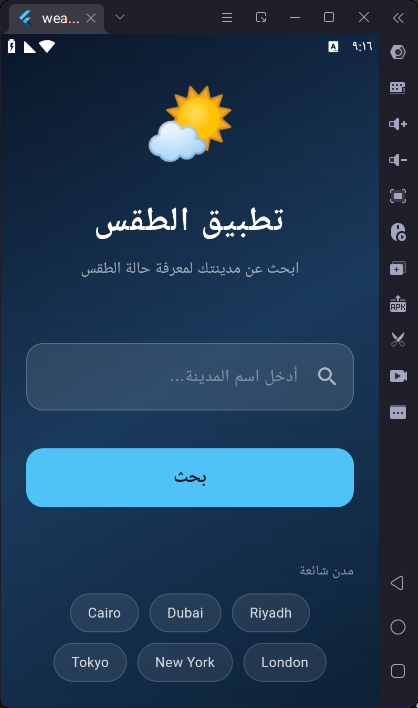
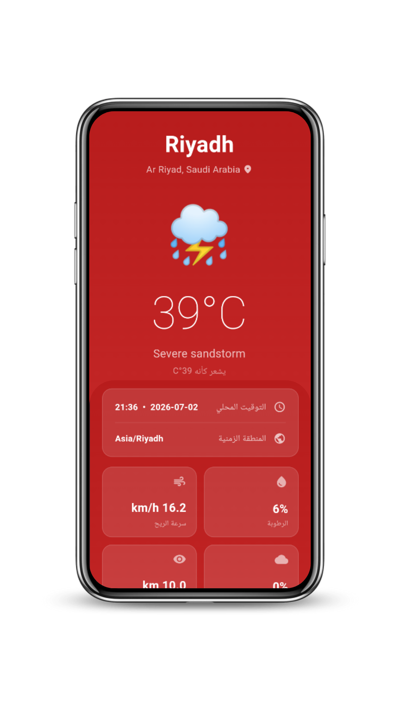

# 🌦️ ClimaTrack — Flutter Weather Application

A modern and robust Android application built with Flutter that delivers real-time weather information using the WeatherAPI. The project efficiently handles state management, dependency injection, and clean route navigation using the GetX ecosystem.

Developed as an academic assignment to showcase standard practices in REST API integration and multi-screen architecture.

---

## 📸 Application Preview

| 🔍 Search Screen | 🌡️ Weather Details | 🌐 City Info |
| :---: | :---: | :---: |
|  <br> *Find any location* |  <br> *Complete breakdown* |  <br> *Timezone & region* |


---

## ✨ Core Features

* **Global Search:** Fetch instantaneous weather status for any city worldwide.
* **Dual Metrics:** View current temperatures in both Celsius (°C) and Fahrenheit (°F).
* **Localized Insights:** Display local time, timezone IDs, country, and specific region details.
* **Deep Weather Metrics:** Track humidity levels, wind speed, visibility, UV index, and cloud coverage.
* **Smart Presets:** Quick-access shortcuts to view weather data for major popular cities instantly.
* **Adaptive User Interface:** Dynamic background colors that transition based on the current temperature.
* **Resilient Architecture:** Full error handling for network failures or unrecognized city queries.

---

## 🛠️ Technical Toolkit

| Core Technology | Purpose |
| :--- | :--- |
| **Flutter** | Cross-platform UI development framework |
| **GetX** | State management, dependency injection, and navigation |
| **http** | Executing asynchronous REST API calls |
| **WeatherAPI.com** | Reliable data source provider for global weather |

---

## 🏗️ Architecture & Project Directory

```text
lib/
├── main.dart                  # Application entry point & named routing configuration
├── bindings/
│   └── weather_binding.dart   # Dependency injection setup using GetX Bindings
├── controllers/
│   └── weather_controller.dart# Business logic, asynchronous API requests & reactive state
├── models/
│   └── weather_model.dart     # Data deserialization layer (fromJson factory)
└── views/
    ├── search_screen.dart     # Primary View: Location query input
    ├── details_screen.dart    # Secondary View: Granular weather metrics
    └── info_screen.dart       # Tertiary View: Geographic & timezone breakdowns

```

---

## 📦 Project Dependencies

The application relies on the following packages specified in `pubspec.yaml`:

```yaml
dependencies:
  get: ^4.6.6        # High-performance state management & navigation routing
  http: ^1.1.0       # Optimized library for composable HTTP requests
  intl: ^0.18.1      # Comprehensive date and time formatting utilities

```

---

## 🔌 API Integration Reference

The app connects directly to the following **WeatherAPI** endpoint:
`GET https://api.weatherapi.com/v1/current.json?key={API_KEY}&q={city}`

### Data Mapping Table

| JSON Response Path | Extracted Variable | Field Description |
| --- | --- | --- |
| `location.name` | City Name | Target location identity |
| `location.country` | Country | Destination nation |
| `location.region` | Region / State | Province or state classification |
| `location.tz_id` | Timezone | Regional timezone identifier (e.g., Asia/Riyadh) |
| `location.localtime` | Local Time | Current clock time at the location |
| `current.temp_c` / `temp_f` | Temperature | Degrees in Celsius or Fahrenheit |
| `current.condition.text` | Condition | Clear, Rainy, Cloudy, etc. |
| `current.humidity` | Humidity | Atmospheric moisture percentage |
| `current.wind_kph` | Wind Speed | Movement velocity in km/h |
| `current.uv` | UV Index | Solar ultraviolet radiation level |

---

## 🗂️ Reactive State Management (GetX)

### Observables Configuration

State properties are fully reactive within `WeatherController` via Rx types:

```dart
// Controller State Layer
final Rx<WeatherModel?> weather = Rx<WeatherModel?>(null);
final RxBool isLoading = false.obs;
final RxString errorMessage = ''.obs;

```

### UI Binding

Views autonomously reconstruct by wrapping components inside an `Obx` widget to listen to observable changes:

```dart
// Reactive View Layer
Obx(() => controller.isLoading.value
    ? const CircularProgressIndicator()
    : Text('${controller.weather.value?.tempC}°C')
)

```

### Named Navigation Ecosystem

Routing actions pass seamlessly without context dependency:

```dart
// Transition Layer
Get.toNamed('/details');
Get.toNamed('/info', arguments: weatherModel);

```

---

## 🚀 Getting Started

### Prerequisites

* Flutter SDK (Version `>= 3.0.0` recommended)
* A valid private API Key from [WeatherAPI](https://www.weatherapi.com/)

### Installation & Setup

1. **Clone the Project**
```bash
git clone [https://github.com/your-username/weather-app.git](https://github.com/RzanBash/weather-app.git)
cd weather-app

```


2. **Configure API Credentials**
Navigate to `lib/controllers/weather_controller.dart` and populate your key into the designated constant:
```dart
static const String _apiKey = 'YOUR_API_KEY_HERE';

```


3. **Fetch Packages**
```bash
flutter pub get

```


4. **Execute Application**
```bash
flutter run


```
